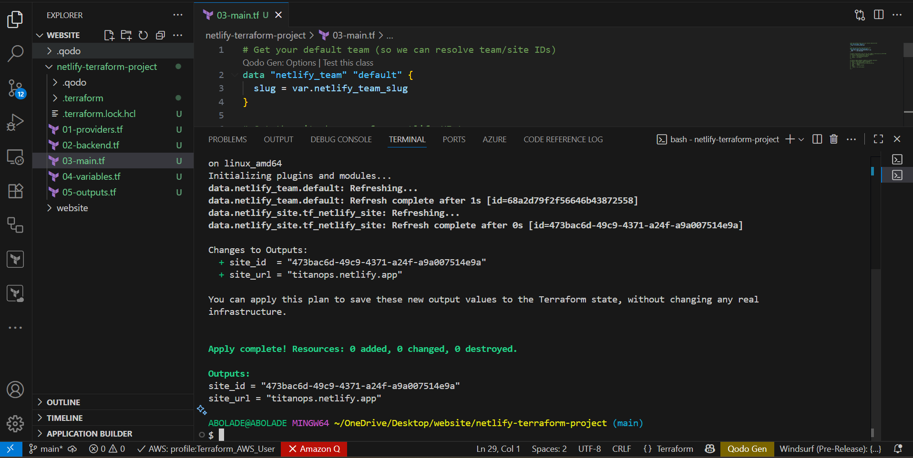

---
#Github
Github repo url: https://github.com/sheriffcloud/nexus-flow-site

# Terraform + Netlify Deployment with HCP Terraform

This project demonstrates how to provision and manage a static site on **Netlify** using **Terraform**, with remote state management through **HCP Terraform (Terraform Cloud)**.

---

##  Prerequisites
- **Terraform**: v1.5+ installed locally.
- **Accounts Needed**:
  - [Netlify Account](https://www.netlify.com/)
  - [HCP Terraform Account](https://app.terraform.io/)
- **Netlify Personal Access Token**: generated from your Netlify user settings.

---

##  Authentication & Configuration

### 1. Connect to HCP Terraform
Update your `backend` block with your **HCP Organization** and **Workspace**:

```hcl
terraform {
  cloud {
    organization = "your-org-name"
    workspaces {
      name = "your-workspace-name"
    }
  }
}
2. Set Netlify Credentials
Export your Netlify token before running Terraform:
set it in your HCP Terraform workspace environment variables.

```
## Variables
Key variables are defined in variables.tf:

site_name: Name of your Netlify site,
netlify_api_token: your netlify token you generated earlier and added to HCP Terraform cloud,
netlify_team_slug: you can get your team slug from netflify team settings.

---
## Outputs
site_url: This will output the url of the live site,
site_id: This will also output the site ID.

---
## Running Terraform
terraform init,
terraform plan,
terraform apply,
After apply, Terraform outputs:

site_url → https://titanops.netlify.app/ and 
id → 473bac6d-49c9-4371-a24f-a9a007514e9a

📂 .gitignore
# .terraform (provider binaries, external module source code, …)
**/.terraform/*
# state files
*.tfstate
*.tfstate.*

# Crash log files (if you run Terraform locally)
crash.log
crash.*.log

# Variable files
*.tfvars
*.tfvars.json

# Override files (HCL or JSON, depending on your configuration)
override.tf
override.tf.json
*_override.tf
*_override.tf.json

# Terraform CLI configuration files
.terraformrc
terraform.rc

2. ## Live Demo
Live Site: https://titanops.netlify.app/

